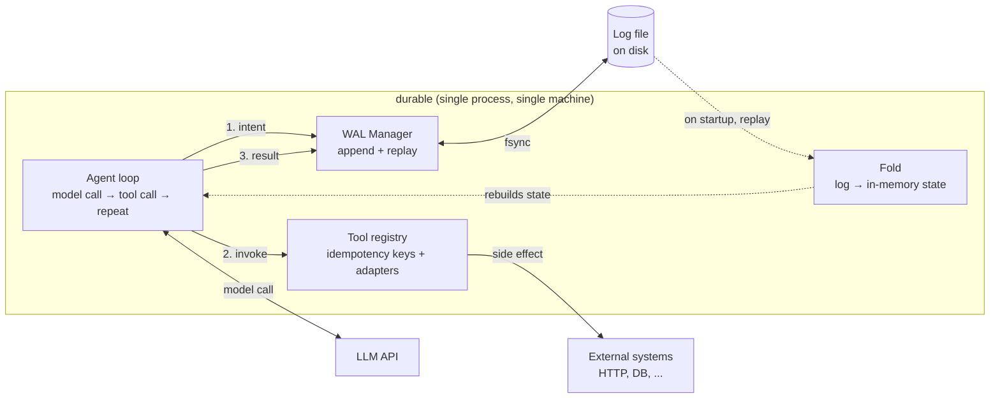
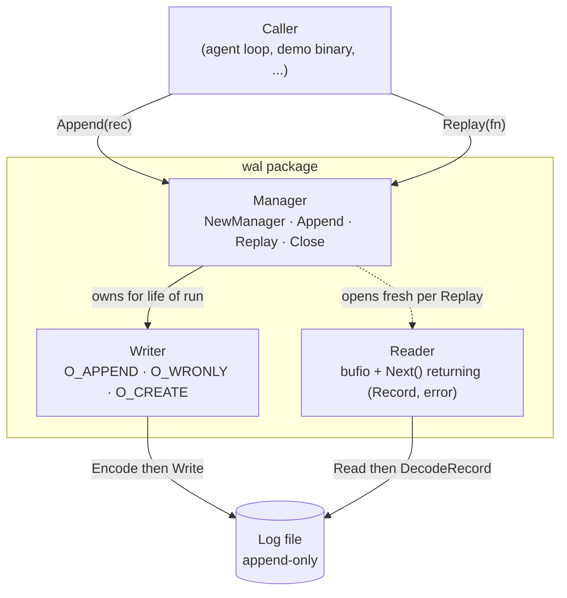

# durable

A from-scratch durable execution engine for LLM agents. Single-machine, single-process, Go.

> Built to understand durable execution from the inside — not to compete with Temporal, Restate, Inngest, or any of the production systems that already solve this well. If you need durable execution in production, use one of those. If you want to understand *how they work*, this might help.

## The problem

**Crash-resistant, replayable, auditable LLM agent runs.**

If agents gets killed mid-tool-call and restarted, the agent should resume from exactly where it left off — without losing progress and without re-executing side effects against the outside world.

## Why this matters

Agents do work in the real world. They send emails, charge cards, write rows to databases, post messages to Slack. Each of those is a *side effect* — once it has happened, you can't pretend it hasn't. An agent crashing halfway through a multi-step task creates two failure modes that are both unacceptable:

1. **Lost progress.** The model's reasoning, the partial results, the accumulated context — all gone. The agent restarts from scratch and the user notices.
2. **Double effects.** The retry re-runs steps whose side effects already happened. Two emails. Two charges. Two rows.

Production agent platforms (LangGraph, the OpenAI/Vercel agent SDKs, Restate, Inngest, Temporal, DBOS, Hatchet, …) solve this with **durable execution**: write the agent's intent to disk *before* the side effect, and use the journaled record to deduplicate retries on recovery. This project rebuilds that primitive from scratch — write-ahead log, deterministic replay, idempotency keys, the whole stack — for one purpose: to understand what those production systems are actually doing under the surface.

It is an internals exercise. It is not a product.

## The load-bearing idea: write-ahead ordering

The whole system rests on one invariant:

> The intent to perform a side effect is written and `fsync`-ed to disk *before* the side effect is invoked.

If you flip those two — invoke first, log after — a crash in between leaves you with a side effect that happened in the world with no record of it, and the retry will execute it a second time. That is the canonical bug durable execution exists to prevent.

## System architecture



The numbered arrows are the canonical step the system performs over and over:

1. **Intent.** The agent journals what it's *about* to do (with a stable idempotency key) before any external action happens.
2. **Invoke.** The tool runs. The side effect may or may not succeed — that's fine.
3. **Result.** Whatever happened gets journaled.

If the process crashes between 1 and 3, **replay** sees an intent without a matching result, re-invokes the tool, and the idempotency key keeps the external system from acting twice. The LLM and external systems sit *outside* the durability boundary — the WAL only journals what crosses it.

## The WAL

The WAL package is the foundation everything else sits on. Today it implements **L1** (framing, append, sequential read) and **L2** (a CRC32 on every record so torn writes and corruption are detected, never silently trusted). Layers L3 (crash recovery) and L4 (group commit) are next.



The Writer owns one file descriptor for the entire run. The Reader is created fresh for each `Replay` call, drained, and discarded — writes are continuous (every step), reads are bursty (startup + debug). Different lifecycles, different ownership models.

**On-disk record format:**

```
+------------------+---------------+----------------+---------------------------+
| length (4 bytes) | crc32 (4 byte)| type (1 byte)  | payload (length-1 bytes)  |
+------------------+---------------+----------------+---------------------------+
```

- `length` — `uint32` little-endian. Size of the body `(type + payload)`, not including itself or the crc.
- `crc32` — `uint32` little-endian. IEEE CRC32 of the body `(type + payload)`. On read, the reader recomputes it and compares; a mismatch (or malformed framing) returns `ErrCorruptRecord` and halts replay at that record. The length and crc fields are not themselves covered — a corrupted length is instead caught by the body read coming up short or the recomputed checksum failing.
- `type` — 1-byte tag. Today only `RecordTypeRaw = 0x01`. L6 adds `RunStart`, `ModelCallIntent`, `ToolCallResult`, etc.
- `payload` — arbitrary bytes.

There is no separator between records. The length field is what tells the reader where one ends and the next begins.

## Try it

The demo binary takes a string, splits it on whitespace, writes each word as a `Record`, and then replays the log:

```sh
go build -o durable .
./durable "hi my name is prashant"
```

```
appended 5 records to durable.log

replay:
  [0] type=0x01 payload="hi"
  [1] type=0x01 payload="my"
  [2] type=0x01 payload="name"
  [3] type=0x01 payload="is"
  [4] type=0x01 payload="prashant"
```

Run it again and the new words are appended onto the existing log — the file is never truncated:

```sh
./durable "and now i appended more"
```

```
  [0] type=0x01 payload="hi"
  ...
  [5] type=0x01 payload="and"
  [6] type=0x01 payload="now"
  [7] type=0x01 payload="i"
  [8] type=0x01 payload="appended"
  [9] type=0x01 payload="more"
```

Peek at the framing on disk:

```sh
hexdump -C durable.log
```

```
00000000  03 00 00 00 76 8b c9 67  01 68 69 03 00 00 00 57  |....v..g.hi....W|
00000010  6f 09 07 01 6d 79 05 00  00 00 b7 7f 25 84 01 6e  |o...my......%..n|
00000020  61 6d 65 03 00 00 00 4d  43 b0 83 01 69 73 09 00  |ame....MC...is..|
00000030  00 00 68 9b 9e 40 01 70  72 61 73 68 61 6e 74     |..h..@.prashant|
```

`03 00 00 00` = length 3 (little-endian). `76 8b c9 67` = CRC32 of the body. `01` = `RecordTypeRaw`. `68 69` = `"hi"`. Each record is exactly `9 + len(payload)` bytes on disk.

Run the test suite:

```sh
go test ./wal/... -race
```
